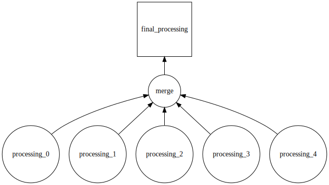

.. _visualize:

:github_url: https://github.com/jrbourbeau/pycondor

*********************
Visualizing Workflows
*********************

The Dagman object directed acyclic graph can be visualized by calling the Dagman ``visualize`` method, or ``pycondor.visualize`` function.  

.. currentmodule:: pycondor.visualize
.. autofunction::
    visualize

Below is an example workflow where a processing script is run on a list of files, then a script to merge the processed outputs is run, and finally a sub-Dagman which does some final processing is run.

.. code-block:: python

    from pycondor import Job, Dagman

    # Load files
    files = ...

    dagman = Dagman(name='example_dagman')

    merge = Job(name='merge',
                executable='merge.py',
                dag=dagman)

    for idx, f in enumerate(files):
        processing = Job(name='processing_{}'.format(idx),
                         executable='process.py',
                         dag=dagman)
        merge.add_parent(processing)
        
    final_processing = Dagman(name='final_processing',
                              dag=dagman)
    final_processing.add_parent(merge)
    
    dag.visualize('workflow.png')

Jobs are shown by circles and sub-Dagman objects are squares in the diagram. Parent/child relationships are indicated by arrows where parent tasks point to their child tasks.

Note that visualizing Dagman graphs requires both the `Graphviz <https://www.graphviz.org/>`_ system library and the ``graphviz`` `Python library <https://github.com/xflr6/graphviz>`_ to be installed. If you use the Conda package manager, you can install ``python-graphviz`` from the `conda-forge channel <https://anaconda.org/conda-forge/python-graphviz>`_ which will install both the system Graphviz as well as the Python library.